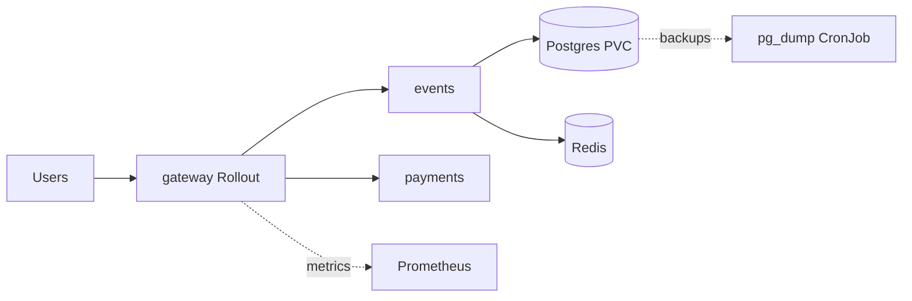

# QuickTicket SRE Handbook

## Architecture



- `gateway` is the public HTTP entrypoint and runs as an Argo Rollouts canary rollout.
- `events` owns inventory, reservations, and order writes.
- `payments` is the mock payment dependency on the write path.
- `Postgres` is the source of truth and now persists on a PVC.
- `Redis` stores reservation holds and is still a single-pod dependency.
- `Prometheus` is in-cluster and is the main operational signal source.

## How to deploy

1. Create a branch named `labNN`.
2. Make the change in the repo and update the relevant `submissions/labN.md`.
3. Open a PR into `main`.
4. After merge, GitHub Actions rebuilds and pushes the images.
5. The image-tag update commits on `main` are the deploy-like events.
6. Argo Rollouts applies the gateway rollout strategy and analysis for gateway changes.
7. Verify:
   - `kubectl get pods,svc`
   - `kubectl get rollout gateway`
   - `kubectl get analysisrun`

## Monitoring

What to check first:

- Gateway 5xx rate:

```promql
sum(rate(gateway_requests_total{status=~"5.."}[5m])) / sum(rate(gateway_requests_total[5m])) * 100
```

- Gateway p99 latency:

```promql
histogram_quantile(0.99, sum by (le, path) (rate(gateway_request_duration_seconds_bucket[5m])))
```

- Current rollout status:

```bash
/home/andrey-debian/.local/bin/kubectl get rollout gateway
/home/andrey-debian/.local/bin/kubectl get analysisrun
```

- Pod health and restarts:

```bash
/home/andrey-debian/.local/bin/kubectl get pods
```

What should be added next:

- alerts on gateway/events p95 and p99 latency
- alerts on readiness flapping and restart spikes
- DB metrics: connections, lock waits, slow queries

## Incident response

Fast triage order:

1. `kubectl get pods` — find crash loops, restarts, or unready pods.
2. `kubectl get rollout gateway` — if a deployment change is in progress, check rollout health first.
3. Query Prometheus for:
   - 5xx ratio
   - p99 latency
   - path-specific failures
4. If the problem is a bad gateway rollout:
   - `kubectl-argo-rollouts abort gateway`
5. If the problem is stale connections after DB recovery:
   - `kubectl rollout restart deployment/events`

Escalation:

- If user-facing 5xx stays above SLO for more than a few minutes, stop experimenting and restore the last known healthy state first.

## Backup / restore

Normal backup:

- CronJob: `postgres-backup`
- Format: `pg_dump -Fc`
- Retention: keep 5 newest dumps

Manual disaster recovery:

1. Copy dump into the Postgres pod if needed.
2. Restore with:

```bash
pg_restore -U quickticket -d quickticket --clean --if-exists /tmp/backup.dump
```

3. Restart `events` so it drops stale DB connections:

```bash
/home/andrey-debian/.local/bin/kubectl rollout restart deployment/events
```

Limits of the current setup:

- Full dumps are good enough for the course project.
- For real production RPO/RTO targets, move to WAL archiving and PITR.
